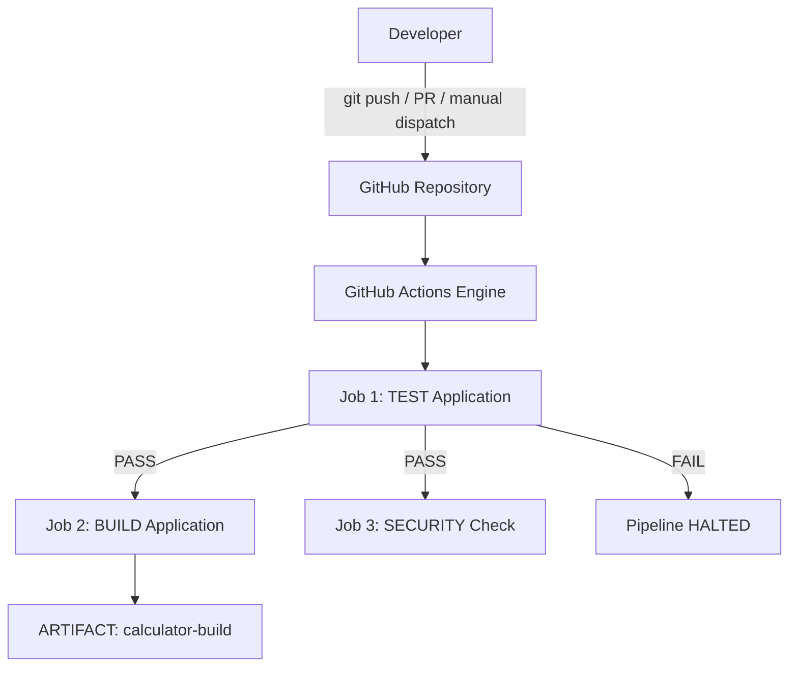

# 10 - Final CI/CD Pipeline

## 1. Architecture



---

## 2. Topics Covered
This project covers the full lifecycle of GitHub Actions and CI/CD:
* **CI vs CD**: Continuous Integration (validation) vs Continuous Delivery / Continuous Deployment (release).
* **CI/CD Pipeline**: Multi-stage automated execution flow.
* **GitHub Actions**: Native automation platform configured in `.github/workflows/`.
* **Workflow**: Top-level automation defined in `ci.yml`.
* **Jobs**: `test`, `build`, and `security-check`.
* **Steps**: Individual execution units using `uses` and `run`.
* **Runners**: Virtual machine execution environment (`runs-on: ubuntu-latest`).
* **Secrets**: Secure storage and injection into workflow environments.
* **Artifacts**: Packaging and retaining build deliverables (`actions/upload-artifact@v4`).
* **Build**: Generating application bundles and metadata via `build.sh`.
* **Test**: Automated unit tests using `pytest` acting as a deployment gate.
* **Pipeline Execution**: Triggering, observing, and testing failure/recovery scenarios.

---

## 3. Workflow Specification (`.github/workflows/ci.yml`)

```yaml
name: Final CI Pipeline
on:
  push:
    branches:
      - main
  pull_request:
    branches:
      - main
  workflow_dispatch:
jobs:
  test:
    name: Test Application
    runs-on: ubuntu-latest
    steps:
      - name: Checkout source code
        uses: actions/checkout@v6
      - name: Setup Python
        uses: actions/setup-python@v7
        with:
          python-version: "3.12"
      - name: Display Python version
        run: python --version
      - name: Install dependencies
        run: |
          python -m pip install --upgrade pip
          pip install -r requirements.txt
      - name: Run tests
        run: |
          pytest -v

  build:
    name: Build Application
    needs: test
    runs-on: ubuntu-latest
    steps:
      - name: Checkout source code
        uses: actions/checkout@v6
      - name: Setup Python
        uses: actions/setup-python@v7
        with:
          python-version: "3.12"
      - name: Build application
        run: |
          chmod +x build.sh
          ./build.sh
      - name: Show build output
        run: |
          cat build/build-info.txt
      - name: Upload build artifact
        uses: actions/upload-artifact@v4
        with:
          name: calculator-build
          path: build/

  security-check:
    name: Security Check
    needs: test
    runs-on: ubuntu-latest
    steps:
      - name: Checkout source code
        uses: actions/checkout@v6
      - name: Check for sensitive files
        run: |
          echo "Checking repository for common sensitive files..."
          if find . -type f \( \
            -name ".env" \
            -o -name "*.pem" \
            -o -name "*.key" \
          \) | grep -q .; then
            echo "Potential sensitive file found."
            exit 1
          else
            echo "No common sensitive files found."
          fi
```

---

## 4. All Commands to Run & Test Each Component

### 1. CI vs CD Testing
```bash
# Test CI simulation (Build + Test verification)
cd "../01-ci-vs-cd 10-33-34-211"
chmod +x ci_simulation.sh && ./ci_simulation.sh

# Test CD simulation (Deployment verification)
chmod +x cd_simulation.sh && ./cd_simulation.sh
```

### 2. Pipeline Concepts Testing
```bash
cd "../02-pipeline-concepts 10-33-34-222"
chmod +x pipeline_stages.sh && ./pipeline_stages.sh
```

### 3. Local Test Execution (`Test Application` Job)
```bash
# Setup dependencies
python3 -m pip install -r requirements.txt

# Run pytest unit tests locally
pytest -v
```

### 4. Local Build Execution (`Build Application` Job)
```bash
# Run build script
chmod +x build.sh
./build.sh

# Inspect generated artifacts
ls -la build/
cat build/build-info.txt
```

### 5. Security Check Testing (`Security Check` Job)
```bash
# Test passing condition locally
find . -type f \( -name ".env" -o -name "*.pem" -o -name "*.key" \)

# Test failure condition
touch .env
# Find command will output .env and exit with status 1 in CI
rm -f .env
```

### 6. Secrets Testing
```bash
# Set repository secret via GitHub CLI
gh secret set DEMO_SECRET --body "hello-github-actions"

# List configured secrets
gh secret list
```

### 7. Workflow Triggers Testing
```bash
# Manual execution trigger (workflow_dispatch)
gh workflow run ci.yml --ref main

# Push trigger
git add .
git commit -m "feat: trigger pipeline via push"
git push origin main

# Pull request trigger
git checkout -b feature/test-pr
git commit --allow-empty -m "test: trigger pipeline on pull request"
git push -u origin feature/test-pr
gh pr create --title "Test CI on PR" --body "Triggering CI check" --base main
```

### 8. Monitoring & Inspecting Pipeline Runs
```bash
# List all workflow runs
gh run list

# Watch active workflow execution live
gh run watch

# View logs for a run
gh run view --log
```

### 9. Downloading and Verifying Artifacts
```bash
# Download build artifact
gh run download -n calculator-build -D ./dist

# Verify contents
cat ./dist/build-info.txt
```

### 10. Failure & Recovery Testing (CI Gatekeeper)
1. **Trigger Failure**:
   ```python
   # In app/calculator.py, break the function:
   def add(a, b):
       return a + b + 1
   ```
   ```bash
   pytest -v  # Fails locally
   git commit -am "test: break unit test to test CI gatekeeper"
   git push origin main
   gh run watch  # Verify test fails and build is skipped
   ```

2. **Restore and Pass**:
   ```python
   # Revert fix in app/calculator.py:
   def add(a, b):
       return a + b
   ```
   ```bash
   pytest -v  # Passes locally
   git commit -am "fix: restore calculator add function"
   git push origin main
   gh run watch  # Verify all 3 jobs succeed
   ```

---

## 5. End-to-End Pipeline Setup & Execution

```bash
# 1. Initialize Git repository
git init
git branch -M main

# 2. Add remote origin
git remote add origin https://github.com/YOUR_USERNAME/session16-cicd-github-actions.git

# 3. Commit all files
git add .
git commit -m "Add final CI/CD pipeline"

# 4. Push to main branch
git push -u origin main

# 5. Monitor pipeline
gh run list
gh run watch
```
